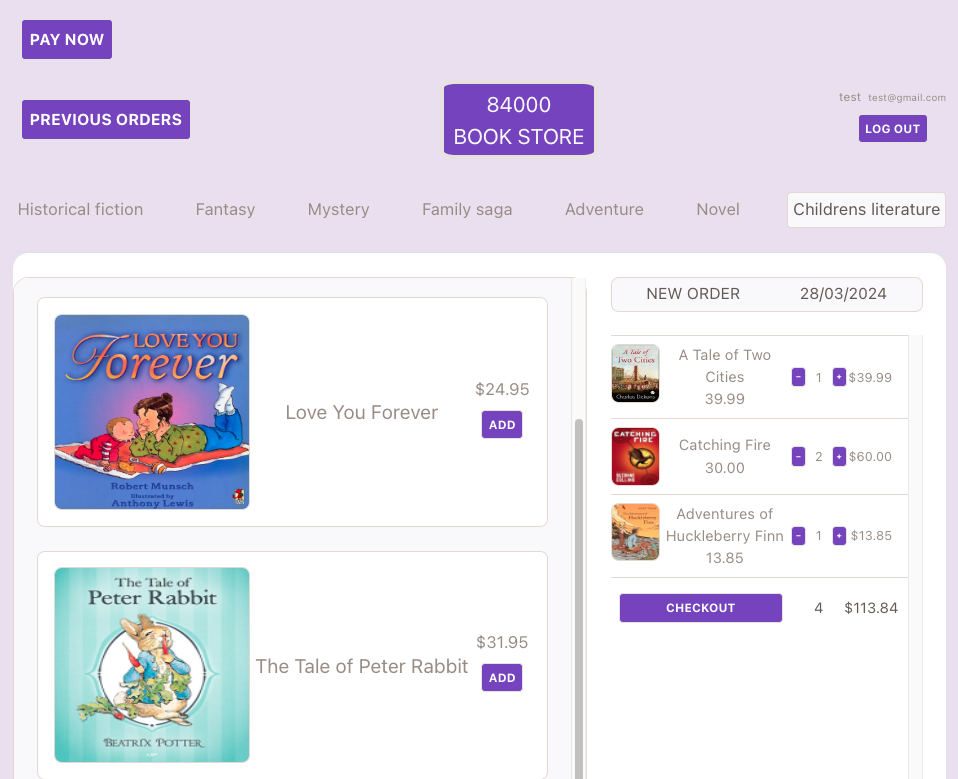

# 84000 Book Store Web App

This is a web application for a book store where users can browse books, add them to their cart, and make purchases. It also includes authentication functionality for users to sign up and log in.

## Screenshot

## Technologies Used

- **Frontend**: React.js
- **Backend**: Node.js, Express.js
- **Database**: MongoDB (via Mongoose)
- **Payment Processing**: Stripe

## Features

- Browse books by categories
- Add books to cart
- View cart and adjust quantities
- Checkout and make payments
- View order history

## Installation

To run this project locally, follow these steps:

1. Clone the repository: `git clone <repository-url>`
2. Navigate to the project directory: `cd <project-folder>`
3. Install dependencies: `npm install`
4. Set up environment variables:
   - Create a `.env` file in the root directory, required APIs
5. Run the development server: `npm start`
6. Visit `http://localhost:3000` in your browser to view the application.

## Contributing

Contributions are welcome! Please feel free to submit issues and pull requests.

## License

This project is licensed under the no LICENSE.
